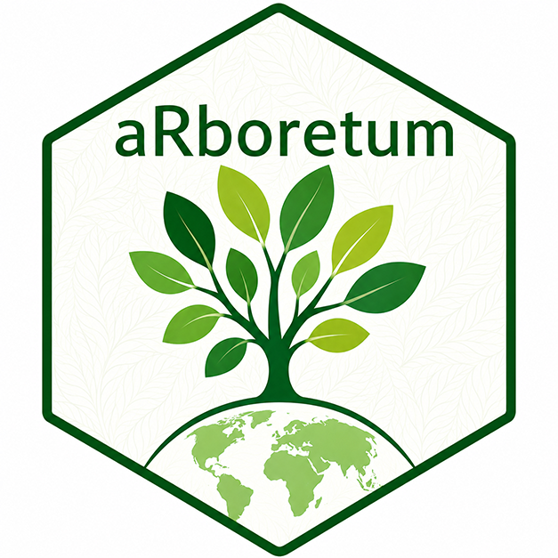

<!-- README.md is generated from README.Rmd. Please edit that file -->

```{r, include = FALSE}
knitr::opts_chunk$set(
  collapse = TRUE,
  comment = "#>",
  fig.path = "man/figures/README-",
  out.width = "100%"
)
```

# aRboretum 

<!-- badges: start -->
[](https://app.codecov.io/gh/DBOSlab/aRboretum)
[](https://github.com/DBOSlab/aRboretum/actions/workflows/test-coverage.yaml)
[](https://github.com/DBOSlab/aRboretum/actions/workflows/R-CMD-check.yaml)
[](LICENSE)
<!-- badges: end -->

`aRboretum` is an R package for generating interactive, multilingual
audio-enhanced HTML labels for botanical and living plant collections.
It extracts species data from taxonomic databases ([Flora e Funga do
Brasil](https://floradobrasil.jbrj.gov.br/) and [Plants of the World
Online](https://powo.science.kew.org/)), handles synonym resolution,
generates natural language descriptions, and produces standalone HTML
files with audio playback capabilities.

## Key features

- 🎵 **Dual audio support** - Personal recordings OR text-to-speech
- 🌐 **Multilingual** - Portuguese, English, French, Spanish, plus one flexible custom language slot for community-based accessibility
- 🗺️ **Interactive maps** - World and Brazil state-level distribution
- 🔍 **Searchable index** - Real-time filtering of species collection
- 📊 **Data mining** - Automatic extraction from FFB and POWO databases
- 🎨 **Customizable branding** - Add institutional logos
- 📱 **Responsive design** - Works on mobile and desktop
- 🚀 **Ready to deploy** - Complete website in one folder, no build step needed 
- 🖼️ **Personal photos** — Add species photos and slideshows
- 🧾 **QR-code labels** — Generate printable labels linked to species pages
- 📊 **Collection dashboard** — Summary statistics in the minisite

Designed to expedite label production for arboreta, botanical gardens,
herbaria, and living plant collections.

## Installation

You can install the development version of `aRboretum` from
[GitHub](https://github.com/DBOSlab/aRboretum) with:

``` r
if (!require("devtools")) install.packages("devtools")
devtools::install_github("DBOSlab/aRboretum")
```

``` r
library(aRboretum)
```

## Usage

The package provides three main functions:

- `arboretum_data()` - retrieves and merges species data from Flora e Funga do Brasil and Plants of the World Online.
- `arboretum_audios()` - creates folders and an HTML recording guide for custom personal audio files, including one optional extra community or local language.
- `arboretum_photos()` — creates folders for personal species photos.
- `arboretum_labels()` - generates interactive multilingual, audio-enhanced HTML species labels, with support for one optional extra language supplied directly in the input data.
- `arboretum_minisite` - creates a searchable multilingual index page for all generated species labels.
- `arboretum_qrcodes()` — generates printable QR-code labels linked to species pages or source URLs.
    

#### *1. `arboretum_data`: Extracting species data from taxonomic databases*

The following code retrieves species information from both Flora e Funga
do Brasil (FFB) and Plants of the World Online (POWO), handling synonym
resolution and merging data from both sources into a single dataframe.  

``` r
library(aRboretum)

# Extract data for multiple species
spp_list <- c("Euterpe edulis", "Paubrasilia echinata", "Coffea arabica")

species_data <- arboretum_data(
  spp_list = spp_list,
  verbose = TRUE,
  save = TRUE,
  format = "xlsx",
  filename = "my_species_data",
  dir = "extracted_data"
)
```

The resulting dataframe includes taxonomic information, distribution data, Brazilian states, phytogeographic domains, vegetation types, endemism, establishment means, IUCN status when available, genus-level richness summaries, and links to FFB and POWO species pages.  
    

#### *2. `arboretum_audios`: Prepare folders for personal audio recordings*

Create folder structure and phrase files for personal audio
recordings:  

``` r
library(aRboretum)

# Create folders for personal audio recordings
arboretum_audios(
  data_path = "extracted_data/my_species_data.xlsx",
  printed_lang = c("pt", "en", "fr", "es"),
  add_lang = "TUKANO",
  verbose = TRUE
)
```

This creates the arboretum_personal_audios/ folder and a searchable HTML guide named:

`arboretum_personal_audios/__personal_audio_recording_guide.html`

Use this guide to record custom audio files for each species and language. Personal recordings are automatically preferred over browser text-to-speech when available.

The optional add_lang argument is especially useful when collaborating with Indigenous peoples or other local communities. It allows you to prepare one additional language for personal audio recording without requiring translation of the full package interface or minisite.

#### *3. `arboretum_photos`: Prepare folders for personal photos*

``` r
library(aRboretum)

arboretum_photos(data_path = "extracted_data/my_species_data.xlsx", 
                 verbose = TRUE )
```

This creates the `arboretum_photos/` folder with one species-specific folder per taxon. Add JPG, PNG, WebP, SVG, or other supported image files to the corresponding folders. When photos are found, `arboretum_labels()` can include them as a slideshow.


#### *4. `arboretum_labels`: Generating audio-enhanced HTML labels*

Once you have your species data (either from `arboretum_data` or
your own prepared dataframe), you can generate interactive HTML labels
with text-to-speech functionality, or automatically use personal
recordings when available:  

``` r
library(aRboretum)

# Generate HTML labels (will use personal recordings if found)
arboretum_labels(
  data_path = "extracted_data/my_species_data.csv",
  audio_dir = "arboretum_audios",  # optional, defaults to this
  printed_lang = c("pt", "en", "fr", "es"),
  add_lang = "TUKANO",
  path_to_logo = "jbrj_logo.png",  # optional
  logo_url = "https://www.jbrj.gov.br",   # optional
  verbose = TRUE,
  dir = "html_species_labels"
)
```

If add_lang is supplied and your input file contains a column named full_phrases_ADD_LANGUAGE, any non-empty text in that column is added as an extra language option in the generated species labels.

This extra language is intended as a flexible accessibility pathway. It is useful when you want to include species text and associated audio in a community or Indigenous language without translating the entire website or minisite interface. In this case, the custom language text is read directly from full_phrases_ADD_LANGUAGE rather than being generated by the standard translation workflow.

Features of generated HTML labels:

🌍 Interactive maps - Distribution maps at global and Brazil state
levels  
🎤 Dual audio - Plays personal recordings if available, falls back to
TTS  
🎵 Visual feedback - Button shows “🎵 Personal Recording” when
available  
🌐 Language selection - Built-in support for Portuguese, English, French, and Spanish, plus one optional custom language  
⏹️ Stop control - Cancel audio playback at any time  
📝 Text preview - Displays spoken text  
🎨 Branding - Optional institutional logo with hyperlink  
📱 Responsive design - Works on all devices  
  
#### *Working with one additional community language*

In some projects, a full translation of the website interface is not necessary, but it is still important to make species information accessible in a local or community language. This can be especially relevant when co-developing interpretive materials with Indigenous peoples.

For this reason, `aRboretum` provides an intermediate workflow through the `add_lang` argument in `arboretum_audios()` and `arboretum_labels()`.

- In `arboretum_audios()`, `add_lang` creates one additional folder per species for personal audio recording.
- In `arboretum_labels()`, `add_lang` adds one extra text option to the species label when the input data includes non-empty values in the column `full_phrases_ADD_LANGUAGE`.
- This extra language bypasses the standard multilingual phrase-generation workflow and is therefore ideal for curated, community-provided text.

A typical workflow is:

1. Prepare your species dataset with the usual columns.
2. Add a column named `full_phrases_ADD_LANGUAGE` containing the full label text in the extra language.
3. Run `arboretum_audios(..., add_lang = "TUKANO")` to create folders for optional personal recordings.
4. Add audio files to the corresponding species folders if desired.
5. Run `arboretum_labels(..., add_lang = "TUKANO")` to include the extra language in the generated labels.

This approach allows the package to support meaningful multilingual accessibility before a full interface translation is implemented.


#### _5. `arboretum_minisite`: Creating a  searchable multilingual minisite index_

After generating your species labels, create a beautiful, searchable index page that lists all species with real-time filtering and multilingual interface:

```r
# Create an index page for all your species labels
arboretum_minisite(
  labels_dir = "html_species_labels",
  site_title = "My Botanical Garden Collection",
  printed_lang = c("pt", "en", "fr", "es"),
  group_by_family = TRUE,
  logo = "garden_logo.png",
  logo_url = "https://www.mybotanicalgarden.org",
  verbose = TRUE
)
```

This creates a searchable index.html page linking to all species labels. When data_path is supplied, the minisite also includes vernacular names and a dashboard summarizing species, genera, families, origin, Brazilian state distribution, phytogeographic domains, and world distribution:

🔍 Real-time search - Filter species by name or family\
🌐 Multilingual interface - Toggle between Portuguese, English, French, Spanish\
📊 Species counter - Shows filtered/total species\
🏷️ Family grouping - Organizes species by family (optional)\
📱 Responsive design - Works on all devices\
🔗 Direct links - Click any card to open its full species label\


#### _6. `arboretum_qrcodes`: Generate printable QR-code labels_

After generating your species labels, create a beautiful, searchable index page that lists all species with real-time filtering and multilingual interface:

```r
# Create qrcodes linked to the species labels
arboretum_qrcodes(
  data_path = "extracted_data/my_species_data.xlsx", 
  base_url = "https://myinstitution.org/my-collection", 
  layout = "complete", 
  printed_lang = "pt", 
  path_to_logo = "jbrj_logo.png", 
  format = "pdf", 
  verbose = TRUE
)
```

QR codes can point to species pages in a published minisite, to a single shared URL, to POWO or FFB source pages, or to the taxon name when no URL is available.


## Complete workflow example

Here’s a complete example from data extraction to custom audio labels:

``` r
# Step 1: Extract species data
my_species <- c(
  "Euterpe edulis",
  "Paubrasilia echinata",
  "Coffea arabica",
  "Luetzelburgia bahiensis"
)

species_data <- arboretum_data(
  spp_list = my_species,
  verbose = TRUE,
  save = TRUE,
  format = "xlsx",
  filename = "my_garden_plants",
  dir = "data"
)

# Step 2: Create folder structure for personal audio
arboretum_audios(
  data_path = "data/my_garden_plants.xlsx",
  printed_lang = c("pt", "en"),
  verbose = TRUE
)

# Step 3: Add your own recordings!
# Place files like:
#   arboretum_personal_audios/ARECACEAE_Euterpe_edulis_EN/my_recording.mp3
#   arboretum_personal_audios/ARECACEAE_Euterpe_edulis_PT/gravacao_pessoal.wav

# Step 4: Prepare personal photo folders 
arboretum_photos(
  data_path = "data/my_garden_plants.xlsx", 
  verbose = TRUE
)

# Step 5: Generate HTML labels (automatically uses your recordings)
arboretum_labels(
  data_path = "data/my_garden_plants.xlsx",
  printed_lang = c("pt", "en"),
  rate = 0.9,
  path_to_logo = "my_garden_logo.png",
  dir = "labels"
)

# Step 6: Create a multilingual minisite index
arboretum_minisite(
  labels_dir = "labels",
  site_title = "My Botanical Garden Collection",
  printed_lang = c("pt", "en"),
  group_by_family = TRUE,
  logo = "my_garden_logo.png",
  verbose = TRUE
)

# Step 7: Generate QR-code labels linked to the published minisite 
arboretum_qrcodes(
  data_path = "data/my_garden_plants.xlsx", 
  base_url = "https://myinstitution.org/my-collection", 
  layout = "complete", 
  printed_lang = "pt", 
  path_to_logo = "my_garden_logo.png", 
  format = "pdf", 
  verbose = TRUE
)

# Step 8: Deploy to an internet pages
# Copy the entire 'minisite' folder to your internet page repository
# The index.html file will automatically show all species!

# Labels are now available in the 'labels' directory
# Open in any modern browser to see distribution maps and hear your recordings!
```

## What Happens When You Open index.html?

Landing page loads - Shows all species with search bar and language selector
User searches - Real-time filtering without page reload
Clicks a species card - Opens individual label with:

- Interactive distribution maps
- Audio playback (personal recording or TTS)
- Language switching
- Species description

## Mobile-Friendly & QR Code Ready

The site is fully responsive and works on:

📱 Smartphones (iOS, Android)\
💻 Tablets and laptops\
🖥️ Desktop computers\
For QR codes at your botanical garden:

Point QR codes to individual species URLs:
`https://your-domain.com/ARECACEAE_Euterpe_edulis_label.html`
Visitors scan → instantly see the species label with audio!


## Important Notes for Deployment

⚠️ CRITICAL: When uploading, ensure you upload:

- index.html (the main page)
- All *_label.html files (individual species pages)
- All *_files/ folders (these contain map dependencies)
- The *_files/ folders are essential for interactive maps to work. Without them, the Leaflet maps will not display!


## Input data requirements

The input data for `arboretum_labels()` must include the following
columns (as produced by `arboretum_data()`):

| Column | Description |
|---|---|
| `taxonName` | Accepted scientific name |
| `family` | Botanical family |
| `scientificNameAuthorship` | Scientific name authorship |
| `FFB.vernacularName` | Vernacular names from Flora e Funga do Brasil |
| `country` | Country-level distribution |
| `endemism` | Endemism status |
| `botanical_country` | POWO botanical-country distribution |
| `introduced_to` | Introduced range from POWO |
| `FFB.establishmentMeans` | Native, cultivated, naturalized, etc. |
| `FFB.stateProvince` | Brazilian states |
| `FFB.phytogeographicDomain` | Brazilian phytogeographic domains |
| `FFB.vegetationType` | Vegetation types |
| `IUCN.status` | IUCN status from POWO, when available |
| `POWO.url` | POWO species page |
| `FFB.url` | FFB species page |

## Browser requirements

The generated HTML files require a modern web browser with Web Speech
API support:

- ✅ Google Chrome (recommended for best voice selection)
- ✅ Microsoft Edge
- ✅ Apple Safari
- ✅ Mozilla Firefox (recent versions)

The speech synthesis feature works offline after the page is initially
loaded.

## Audio format support

Personal audio recordings support multiple formats:

- MP3 (recommended for best compatibility)
- WAV
- M4A
- OGG
- FLAC

## Citation

If you use `aRboretum` in your work, please cite:

``` text
Boucknooghe, M. & Cardoso, D. (2025). aRboretum:
Generate Multilingual Audio-Enhanced Labels for Plant Collections.
R package version 1.0.0.
https://github.com/DBOSlab/aRboretum
```

## Documentation

Full function documentation and articles are available at the
`aRboretum` [website](https://dboslab.github.io/aRboretum).

## License

This package is licensed under the MIT License. See the `LICENSE` file
for details.

## Authors

- **Martin Boucknooghe** — Author, Creator Université de Montpellier  
  ORCID: 0000-0001-7072-2656
- **Domingos Cardoso** — Author, Creator, Copyright holder  
  Rio de Janeiro Botanical Garden  
  ORCID: 0000-0001-7072-2656

## Acknowledgments

The package uses data from:

- [Flora e Funga do Brasil (FFB)](https://floradobrasil.jbrj.gov.br/)
- [Plants of the World Online (POWO)](https://powo.science.kew.org/)

## Contributing

Contributions are welcome! Please feel free to submit issues and pull
requests on the GitHub repository.
