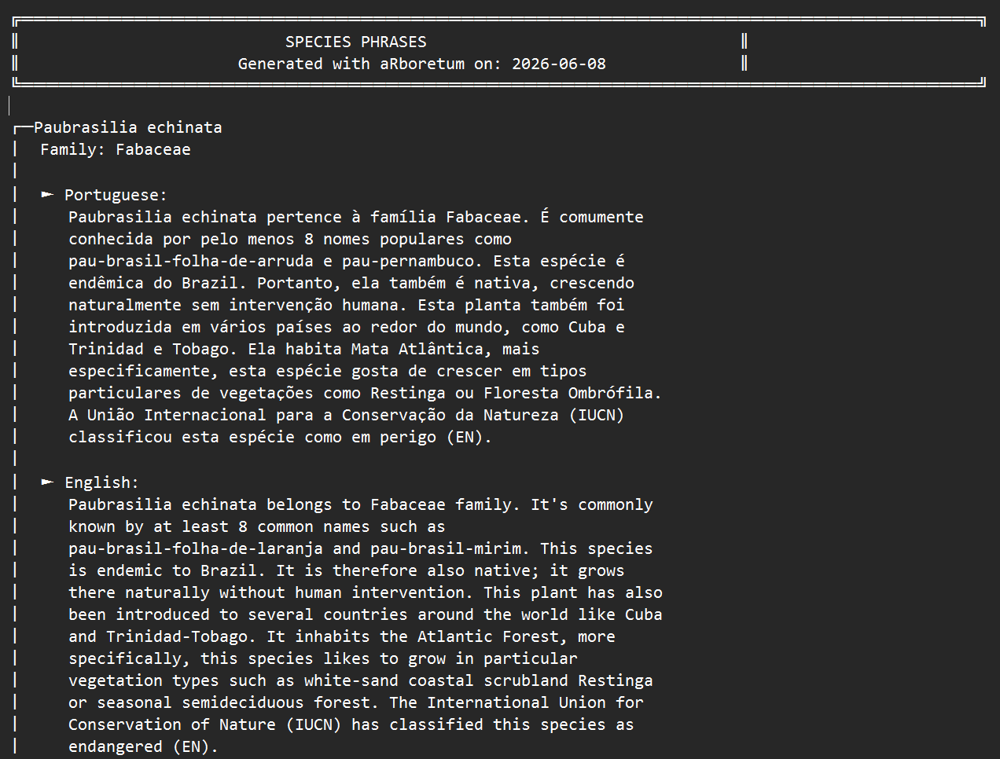

```{r, include = FALSE}
knitr::opts_chunk$set(
  collapse = TRUE,
  comment = "#>",
  eval = FALSE
)
```

## Introduction

The `aRboretum` package can read species descriptions aloud using the browser's built-in text-to-speech (TTS) engine. For a more natural and locally meaningful experience, you can replace synthetic speech with personal audio recordings made by a botanist, guide, teacher, student, or community member.

This workflow is especially useful in participatory outreach and co-developed interpretive projects. It is also useful when collaborators want to include one additional community language in species labels and associated audio without translating the full website or minisite interface.

This vignette shows you how to:

- prepare a species dataset for label generation;
- create the folder structure for personal audio recordings with `arboretum_audios()`;
- optionally add one extra language with `add_lang`;
- organize audio recordings in the expected folders;
- generate HTML labels with `arboretum_labels()` so they use personal audio whenever available.


### Prerequisites

Before starting, make sure you have:

- a species dataset generated with `arboretum_data()` or your own formatted input file;
- a phone or microphone to record audio;
- optional recording/editing software such as Audacity or QuickTime;
- species label text prepared in any additional community language if you want to use `add_lang`.


## Mine the species data

If you have not already done so, first generate your species dataset with `arboretum_data()`.

```{r setup}
library(aRboretum)

species_list <- c("Luetzelburgia bahiensis", "Paubrasilia echinata")

arboretum_data(
  spp_list = species_list,
  save = TRUE,
  format = "xlsx",
  dir = "arboretum_data"
)
```

This creates a folder containing your input spreadsheet, for example:

```text
arboretum_data/
└── arboretum_data.xlsx
```

You can then review and enrich this file before generating labels.


## Optional: add one extra community language

The built-in package languages are Portuguese (`"pt"`), English (`"en"`), French (`"fr"`), and Spanish (`"es"`). In some projects, however, you may want to include species text and audio in one additional community or local language without translating the full interface.

For this purpose, both `arboretum_audios()` and `arboretum_labels()` support the argument `add_lang`.

A typical example is collaboration with Indigenous peoples, where the website can remain in one of the built-in interface languages, but the species label itself should also be available in a language such as Panará or Tukano.

To do this, add a column named `full_phrases_ADD_LANGUAGE` to your dataset. This column should contain the complete final text to be shown in the extra language.

For example:

```{r}
example_df <- data.frame(
  taxonName = c("Paubrasilia echinata", "Euterpe edulis"),
  family = c("Fabaceae", "Arecaceae"),
  full_phrases_ADD_LANGUAGE = c(
    "Texto completo em Tukano para Paubrasilia echinata.",
    "Texto completo em Tukano para Euterpe edulis."
  )
)
```

This extra language text is read directly by `arboretum_labels()`. It does not pass through the standard multilingual phrase-generation workflow.


## Create the audio folder structure and recording guide

Run `arboretum_audios()` with the path to your dataset and the languages you want to support.

The function will:

- create a directory named `arboretum_audios/`;
- create one subfolder per species and per language using the format `FAMILY_Genus_species_LANG` (e.g., `FABACEAE_Paubrasilia_echinata_EN` for English);
- create an HTML guide named `__personal_audio_recording_guide.html` to help navigate species and languages during recording;
- optionally create one extra folder per species for the language supplied in `add_lang`.

```{r}
arboretum_audios(
  data_path = "arboretum_data/arboretum_data.xlsx",
  printed_lang = c("pt", "en"),
  add_lang = "TUKANO",
  verbose = TRUE
)
```

The resulting structure may look like this:

```text
arboretum_audios/
├── ARECACEAE_Euterpe_edulis_EN/
├── ARECACEAE_Euterpe_edulis_TUKANO/
├── ARECACEAE_Euterpe_edulis_PT/
├── FABACEAE_Paubrasilia_echinata_EN/
├── FABACEAE_Paubrasilia_echinata_TUKANO/
├── FABACEAE_Paubrasilia_echinata_PT/
└── __personal_audio_recording_guide.html
```

The extra `TUKANO` folders are created only because `add_lang = "TUKANO"` was supplied.

Important: The phrase file is regenerated every time you run arboretum_personal_audios(). If you already placed audio files, the folders are not overwritten; only missing folders are created.

## Record your audio files

Open the recording guide:

```text
arboretum_audios/__personal_audio_recording_guide.html
```


<p><em>Example of the text file containing species phrases (here for Paubrasilia echinata (en; pt))
</em></p>

This guide helps you browse the available species and language folders while preparing recordings.

For each species and language you want to support, place one audio file inside the matching folder. Accepted file formats include MP3, WAV, M4A, OGG, and FLAC.

Example:

- `arboretum_audios/FABACEAE_Paubrasilia_echinata_EN/my_recording.mp3`
- `arboretum_audios/FABACEAE_Paubrasilia_echinata_PT/minha_gravacao.wav`
- `arboretum_audios/FABACEAE_Paubrasilia_echinata_TUKANO/tukano_recording.m4a`

There is no required file name, any audio file in the folder will be detected (if multiple files are present, the first one alphabetically is used).


## Generate the HTML labels (with personal audio)

Now run `arboretum_labels()` and point it to the audio folder using `audio_dir`.

The function will:

- generate one HTML label per species;
- copy the personal audio folder into the label output directory;
- use personal recordings when they exist;
- fall back to browser TTS when no personal recording is available;
- add the extra language when `add_lang` is supplied and `full_phrases_ADD_LANGUAGE` contains non-empty text.

```{r}
arboretum_labels(
  data_path = "arboretum_data/arboretum_data.xlsx",
  audio_dir = "arboretum_audios",
  printed_lang = c("pt", "en", "fr"),
  add_lang = "TUKANO",
  dir = "arboretum_labels",
  verbose = TRUE
)
```


## What happens in the final labels

After running `arboretum_labels()`:

- Portuguese and English are generated through the standard package workflow;
- Tukano text is read directly from `full_phrases_ADD_LANGUAGE`;
- Tukano appears as an additional language option in the HTML labels when that column contains text;
- personal recordings are used whenever available;
- when no personal recording exists, the label falls back to browser TTS.

For additional languages supplied with `add_lang`, browser speech synthesis may not work reliably unless the operating system provides a compatible voice. Personal recordings are therefore strongly recommended for the extra language.


## Additional information

## Output structure

A typical output directory looks like this:

```text
arboretum_labels/
├── __arboretum_audios/
│   ├── FABACEAE_Paubrasilia_echinata_EN/
│   │   └── my_recording.mp3
│   ├── FABACEAE_Paubrasilia_echinata_TUKANO/
│   │   └── tukano_recording.m4a
│   ├── FABACEAE_Paubrasilia_echinata_PT/
│   │   └── minha_gravacao.wav
│   └── ...
├── FABACEAE_Paubrasilia_echinata_label.html
└── PAPILIONACEAE_Luetzelburgia_bahiensis_label.html
```

The leading `__` in the copied audio folder helps avoid conflicts with the generated label files.

## Minimal schema for the `add_lang` workflow

For a custom-language workflow such as `add_lang = "TUKANO"`, the most important requirement is a column named `full_phrases_ADD_LANGUAGE`.

A minimal toy example is:

```{r}
tukano_example <- data.frame(
  taxonName = c("Paubrasilia echinata", "Euterpe edulis"),
  family = c("Fabaceae", "Arecaceae"),
  full_phrases_ADD_LANGUAGE = c(
    "Texto completo em Tukano para Paubrasilia echinata.",
    "Texto completo em Tukano para Euterpe edulis."
  ),
  stringsAsFactors = FALSE
)
```

A more realistic file may also include built-in language notes and uses:

```{r}
tukano_example <- data.frame(
  taxonName = c("Paubrasilia echinata", "Euterpe edulis"),
  family = c("Fabaceae", "Arecaceae"),
  plant_uses_PT = c("Madeira e uso ornamental.", "Alimentação e paisagismo."),
  free_notes_PT = c("Espécie simbólica no Brasil.", "Espécie importante da Mata Atlântica."),
  full_phrases_ADD_LANGUAGE = c(
    "Texto completo em Tukano para Paubrasilia echinata.",
    "Texto completo em Tukano para Euterpe edulis."
  ),
  stringsAsFactors = FALSE
)
```

## Why `add_lang` matters

The `add_lang` argument provides a flexible, interim pathway for including one additional community or local language in species labels and associated audio, without requiring translation of the full website or minisite interface.

This makes it particularly valuable in collaborative work with Indigenous peoples and other communities, where species-level accessibility may be more important than full interface translation.

## Next steps

You can combine this workflow with custom photos and a searchable index page to build a richer collection of digital species labels.
